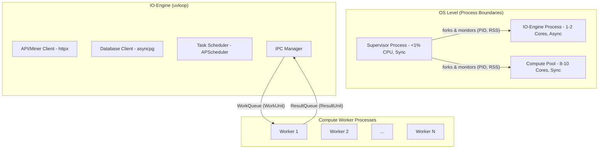

# Gaia Validator: v4.0 Architecture & Refactor Guide

**Document Status:** FINAL | **Version:** 4.0

## 1. Introduction & Motivation

This document serves as the high-level guide to the v4.0 architecture of the Gaia Validator. The primary motivation for this refactor is to address critical performance, stability, and maintainability issues that arose from the original monolithic, single-process design.

The previous architecture suffered from:
- **Event Loop Saturation:** CPU-bound calculations and I/O operations blocked each other, causing high latency.
- **GIL Bottleneck:** Inability to utilize multiple CPU cores on modern hardware.
- **Memory Instability:** Uncontained memory leaks led to unpredictable resource usage and process crashes.
- **Low Maintainability:** Large, coupled files made development slow and error-prone.

The new v4.0 architecture fundamentally solves these problems by adopting a robust, multi-process model designed for performance and stability on multi-core servers.

## 2. Guiding Principles

The new architecture adheres to the following core principles:
1.  **Process-Level Isolation:** I/O and Compute are strictly segregated.
2.  **Embrace the Multi-Core Reality:** The system is designed from the ground up to use multiple CPU cores in parallel.
3.  **Memory Stability is Non-Negotiable:** Process recycling and hard memory limits ensure a predictable memory footprint.
4.  **Explicit, Type-Safe Interfaces:** Clear contracts between components reduce bugs and improve readability.
5.  **Simplicity First:** The architecture uses the simplest robust tools (`multiprocessing`) suitable for a single-node deployment.

## 3. The Supervisor-IO-Compute Architecture

The new architecture is composed of three distinct process types, each with a single responsibility.



- **Supervisor (`validator.py`):** The main entrypoint and parent process. Its only job is to start, monitor, and restart its children, ensuring the application stays alive.
- **IO-Engine:** The asynchronous brain. It handles all network communication (database, miners), schedules all recurring tasks, and orchestrates the overall application logic. It does *no* heavy computation.
- **Compute Pool:** A set of disposable, single-purpose worker processes. They execute CPU-heavy and memory-intensive tasks (like data hashing, scoring, and interacting with potentially leaky C-extensions) and then exit, releasing all their memory.

This separation ensures that the responsive IO-Engine is never blocked and that the system can scale across all available CPU cores while containing memory leaks.

## 4. New Codebase Structure

The codebase is being reorganized from large monoliths into small, single-responsibility modules. The new structure can be visualized as:

```
gaia/
├── validator/
│   ├── app/                # The new application core (Supervisor, IO-Engine, Compute Worker)
│   ├── db/                 # Database abstraction layer
│   └── utils/              # Shared utilities (config, ipc_types)
└── tasks/
    └── defined_tasks/
        ├── base.py         # The abstract GaiaTask interface
        └── weather/
            ├── task.py     # The lean, refactored WeatherTask
            └── validator/  # All weather-specific validator logic
```
This modularity improves testability and makes the system easier to understand and maintain.

## 5. Implementation Roadmap

The full refactoring process is broken down into a series of detailed, sequential phases. Each phase is documented in its own file within this directory, providing a granular, step-by-step guide for implementation.

**Please refer to the following documents for the detailed plan:**

- **Phase 0: [Environment & Tooling Setup](./00_phase_0_tooling.md)**
  - *Setting up dependencies, linters, and type checkers.*

- **Phase 1: [Codebase Decomposition & Structure](./01_phase_1_decomposition.md)**
  - *Creating the new directory structure and defining the migration checklists.*

- **Phase 2: [Core Infrastructure Implementation](./02_phase_2_infrastructure.md)**
  - *Building the Supervisor, IO-Engine, and Compute Worker skeletons.*

- **Phase 3: [Logic Migration](./03_phase_3_logic_migration.md)**
  - *Moving business logic (config, DB, scoring, etc.) into the new architecture.*

- **Phases 4, 5, & 6: [Validation, Deployment, and Rollout](./04_phase_4_5_6_validation_and_rollout.md)**
  - *The final plan for testing, observability, and a safe production deployment.* 