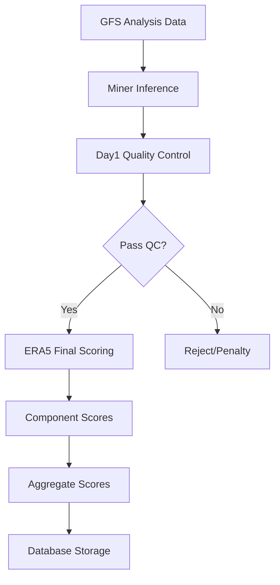

# Weather Forecasting Scoring System Documentation

## Table of Contents
1. [Overview](#overview)
2. [Scoring Pipeline](#scoring-pipeline)
3. [Variables and Pressure Levels](#variables-and-pressure-levels)
4. [Scoring Metrics](#scoring-metrics)
5. [Weighting System](#weighting-system)
6. [Quality Control (Day1 Scoring)](#quality-control-day1-scoring)
7. [Final Evaluation (ERA5 Scoring)](#final-evaluation-era5-scoring)
8. [Clone Detection](#clone-detection)
9. [Database Schema](#database-schema)
10. [Scientific Rationale](#scientific-rationale)

---

## Overview

The Gaia weather forecasting scoring system evaluates machine learning models' ability to predict atmospheric conditions across multiple variables, pressure levels, and forecast lead times. The system implements a two-tier evaluation approach:

1. **Day1 Scoring (Quality Control)**: Fast initial assessment using 5 essential variables
2. **ERA5 Scoring (Final Evaluation)**: Comprehensive evaluation using 9 variables across 13 pressure levels

### Key Design Principles

- **Scientific Rigor**: Uses established meteorological evaluation metrics (MSE, ACC, Skill Scores)
- **Operational Relevance**: Focuses on variables critical for weather prediction
- **Scalability**: Efficient processing of large atmospheric datasets
- **Transparency**: Per-variable, per-pressure-level scoring for detailed analysis

---

## Scoring Pipeline

### High-Level Flow



### Detailed Pipeline Steps

1. **Data Preparation**
   - Fetch GFS analysis data (T0 and T-6 hours)
   - Prepare Aurora model input batch
   - Generate canonical input hash

2. **Model Inference**
   - Run miner's ML model on GFS input
   - Generate 10-day forecast (240 hours)
   - Store forecast in Zarr format

3. **Day1 Scoring (Quality Control)**
   - Evaluate first 12-hour forecast
   - Use 5 essential surface variables
   - Fast pass/fail assessment

4. **ERA5 Scoring (Final Evaluation)**
   - Comprehensive evaluation across all variables
   - Multiple forecast lead times (24h, 48h, 72h, etc.)
   - Per-pressure-level analysis

5. **Score Aggregation**
   - Weight scores by variable importance
   - Combine across pressure levels and lead times
   - Generate final miner ranking

---

## Variables and Pressure Levels

### Surface Variables (4 variables)

| Variable | Name | Units | Description | Why Important |
|----------|------|-------|-------------|---------------|
| `2t` | 2-meter Temperature | K | Surface air temperature | **Critical for human comfort, agriculture, energy demand. Most directly felt weather parameter.** |
| `10u` | 10-meter U-wind | m/s | Eastward wind component | **Essential for wind energy, aviation, storm tracking. Combined with 10v gives wind vector.** |
| `10v` | 10-meter V-wind | m/s | Northward wind component | **Complements 10u for complete surface wind characterization.** |
| `msl` | Mean Sea Level Pressure | Pa | Pressure reduced to sea level | **Fundamental for synoptic meteorology, storm systems, pressure gradients drive weather.** |

### Atmospheric Variables (5 variables × 13 pressure levels = 65 combinations)

| Variable | Name | Units | Description | Why Important |
|----------|------|-------|-------------|---------------|
| `t` | Temperature | K | Air temperature at pressure levels | **Temperature structure determines atmospheric stability, convection, and energy transport.** |
| `u` | U-wind Component | m/s | Eastward wind at pressure levels | **Upper-level winds drive weather systems, jet streams, and atmospheric transport.** |
| `v` | V-wind Component | m/s | Northward wind at pressure levels | **Combined with u-wind, defines atmospheric circulation patterns.** |
| `q` | Specific Humidity | kg/kg | Water vapor content | **Controls precipitation, cloud formation, and latent heat release in weather systems.** |
| `z` | Geopotential | m²/s² | Gravitational potential energy | **Geopotential height fields define pressure systems, troughs, ridges, and atmospheric waves.** |

### Pressure Levels (13 levels)

```
Surface → Upper Atmosphere
1000 → 925 → 850 → 700 → 600 → 500 → 400 → 300 → 250 → 200 → 150 → 100 → 50 hPa
```

**Scientific Rationale for Pressure Level Selection:**
- **1000-850 hPa**: Boundary layer, surface weather systems
- **700-500 hPa**: Mid-troposphere, significant weather features
- **400-200 hPa**: Upper troposphere, jet streams, storm steering
- **150-50 hPa**: Lower stratosphere, large-scale circulation

---

## Scoring Metrics

### 1. Mean Squared Error (MSE)

**Formula**: `MSE = mean((forecast - truth)²)`

**Purpose**: Measures average squared differences between forecast and observations.

**Why MSE?**
- **Penalizes large errors**: Quadratic penalty emphasizes accuracy for extreme events
- **Differentiable**: Enables gradient-based model optimization
- **Interpretable units**: Same units as variable squared (e.g., K² for temperature)

### 2. Root Mean Squared Error (RMSE)

**Formula**: `RMSE = sqrt(MSE)`

**Purpose**: MSE in original variable units for intuitive interpretation.

**Why RMSE?**
- **Physical interpretation**: Directly comparable to variable magnitudes
- **Standard metric**: Widely used in meteorology for model verification
- **Error magnitude**: Typical forecast error in original units

### 3. Anomaly Correlation Coefficient (ACC)

**Formula**: `ACC = correlation(forecast_anomaly, truth_anomaly)`

where `anomaly = value - climatology`

**Purpose**: Measures pattern correlation after removing seasonal cycle.

**Why ACC?**
- **Pattern skill**: Evaluates spatial pattern accuracy independent of bias
- **Anomaly focus**: Emphasizes departure from normal conditions (weather events)
- **Operational standard**: Used by major weather centers (ECMWF, NCEP)
- **Skill assessment**: Values > 0.6 considered skillful for medium-range forecasts

### 4. Skill Score

**Formula**: `Skill Score = 1 - (MSE_forecast / MSE_reference)`

**Purpose**: Measures improvement over reference forecast (climatology or persistence).

**Why Skill Scores?**
- **Relative performance**: Compares against baseline expectations
- **Dimensionless**: Allows comparison across different variables
- **Improvement measure**: Positive values indicate skill over reference
- **Benchmark standard**: Essential for demonstrating forecast value

### 5. Bias

**Formula**: `Bias = mean(forecast - truth)`

**Purpose**: Measures systematic over/under-prediction.

**Why Track Bias?**
- **Systematic errors**: Identifies model calibration issues
- **Correctable**: Bias can often be removed through post-processing
- **Physical insight**: Reveals model physics deficiencies

### 6. Mean Absolute Error (MAE)

**Formula**: `MAE = mean(|forecast - truth|)`

**Purpose**: Average absolute error, less sensitive to outliers than MSE.

**Why MAE?**
- **Robust metric**: Less influenced by extreme errors
- **Linear penalty**: Equal weight to all errors
- **Complementary**: Provides different perspective than MSE

---

## Weighting System

### Variable Weights (Day1 Scoring)

| Variable | Weight | Rationale |
|----------|--------|-----------|
| `2t` | 0.25 | **High impact**: Most directly experienced weather parameter |
| `msl` | 0.20 | **Synoptic importance**: Drives large-scale weather patterns |
| `z` | 0.15 | **Atmospheric structure**: Critical for understanding weather systems |
| `u`, `v` | 0.10 each | **Wind components**: Important for transport and dynamics |
| `q` | 0.05 | **Moisture**: Significant but often secondary in short-range |

### Pressure Level Weights (ERA5 Scoring)

**Surface Variables**: Equal weight (no pressure weighting)

**Atmospheric Variables**: Mass-weighted by pressure level thickness

```python
# Pressure level weighting accounts for atmospheric mass distribution
weight_500hPa = (600 - 400) / 2 = 100 hPa thickness
weight_100hPa = (150 - 50) / 2 = 50 hPa thickness
```

**Scientific Rationale**:
- **Mass representation**: Thicker layers contain more atmospheric mass
- **Physical relevance**: Errors in high-mass regions have greater impact
- **Operational practice**: Follows WMO standards for atmospheric verification

### Spatial Weighting

**Latitude Weighting**: `weight = cos(latitude)`

**Why Cosine Weighting?**
- **Area correction**: Grid cells shrink toward poles
- **Equal area representation**: Prevents polar over-weighting
- **Standard practice**: Used in global model verification

---

## Quality Control (Day1 Scoring)

### Purpose
Fast initial assessment to identify obviously poor forecasts before expensive ERA5 evaluation.

### Configuration
- **Variables**: 5 essential surface/near-surface variables
- **Lead Time**: Single 12-hour forecast
- **Threshold**: Configurable skill score minimum
- **Processing**: Optimized for speed (~2-3 minutes)

### Scientific Rationale

**Why Day1 Focus?**
- **Predictability**: Highest skill at short range
- **Quality indicator**: Poor Day1 performance indicates fundamental issues
- **Computational efficiency**: Avoids expensive multi-day evaluation for poor models

**Variable Selection Logic**:
- **2t**: Universal importance, high predictability at 12h
- **msl**: Synoptic-scale features, good short-range skill
- **10u/10v**: Surface winds, important for many applications
- **z**: Atmospheric structure, fundamental for dynamics

---

## Final Evaluation (ERA5 Scoring)

### Purpose
Comprehensive evaluation using the gold-standard ERA5 reanalysis dataset.

### Configuration
- **Variables**: 9 variables (4 surface + 5 atmospheric)
- **Pressure Levels**: 13 levels for atmospheric variables
- **Lead Times**: Multiple (24h, 48h, 72h, 96h, 120h, 144h, 168h, 192h, 216h, 240h)
- **Reference Data**: ERA5 reanalysis (0.25° resolution)

### Why ERA5?

**Scientific Gold Standard**:
- **Reanalysis quality**: Best available atmospheric state estimate
- **Global coverage**: Consistent worldwide observations
- **High resolution**: 0.25° spatial, hourly temporal
- **Validated**: Extensively verified against independent observations
- **Operational use**: Used by major weather centers for verification

### Per-Pressure-Level Scoring

**Individual Component Scores**: Each pressure level gets separate evaluation

**Benefits**:
- **Vertical structure analysis**: Identifies model biases at specific levels
- **Physical insight**: Reveals where model physics succeed/fail
- **Targeted improvement**: Enables focused model development
- **Operational relevance**: Different levels matter for different applications

### Lead Time Evaluation

**Multiple Forecast Horizons**: 24h to 240h (10 days)

**Scientific Rationale**:
- **Skill degradation**: Quantifies predictability limits
- **Application relevance**: Different users need different forecast ranges
- **Model comparison**: Reveals relative strengths across time scales
- **Operational insight**: Identifies optimal forecast usage windows

---

## Clone Detection

### Purpose
Identify miners submitting identical or near-identical forecasts to reference data.

### Methods

1. **Statistical Thresholds**: Extremely high correlation with reference data
2. **Pattern Analysis**: Identical spatial patterns across variables
3. **Temporal Consistency**: Suspicious consistency across forecast times

### Thresholds (Day1)

| Variable | Clone Threshold (Correlation) |
|----------|-------------------------------|
| `2t` | > 0.9999 |
| `msl` | > 0.9999 |
| `10u` | > 0.9995 |
| `10v` | > 0.9995 |
| `z` | > 0.9999 |

### Scientific Rationale

**Why Clone Detection?**
- **Fair competition**: Prevents gaming through data copying
- **Model validation**: Ensures genuine ML innovation
- **Operational relevance**: Real forecasts can't copy future observations
- **Quality assurance**: Maintains scientific integrity

---

## Database Schema

### Component Scores Table

```sql
weather_forecast_component_scores (
    run_id INTEGER,
    response_id INTEGER,
    miner_uid INTEGER,
    miner_hotkey TEXT,
    score_type TEXT,           -- 'day1' or 'era5'
    lead_hours INTEGER,        -- Forecast lead time
    valid_time_utc TIMESTAMP,  -- Forecast valid time
    variable_name TEXT,        -- e.g., '2t', 'u', 'z'
    pressure_level INTEGER,    -- NULL for surface, hPa for atmospheric
    rmse FLOAT,
    mse FLOAT,
    acc FLOAT,
    skill_score FLOAT,
    skill_score_gfs FLOAT,
    skill_score_climatology FLOAT,
    bias FLOAT,
    mae FLOAT,
    climatology_check_passed BOOLEAN,
    pattern_correlation FLOAT,
    pattern_correlation_passed BOOLEAN,
    clone_penalty FLOAT,
    quality_penalty FLOAT,
    weighted_score FLOAT,
    variable_weight FLOAT,
    calculation_duration_ms INTEGER
)
```

### Aggregate Scores Table

```sql
weather_miner_scores (
    run_id INTEGER,
    response_id INTEGER,
    miner_uid INTEGER,
    miner_hotkey TEXT,
    score_type TEXT,
    lead_hours INTEGER,
    total_score FLOAT,
    component_count INTEGER,
    avg_rmse FLOAT,
    avg_acc FLOAT,
    avg_skill_score FLOAT,
    clone_detected BOOLEAN,
    quality_issues BOOLEAN
)
```

---

## Scientific Rationale

### Why This Scoring System?

#### 1. **Operational Relevance**
The variables and metrics chosen reflect real-world weather forecasting needs:
- **Temperature**: Human comfort, agriculture, energy
- **Pressure**: Storm tracking, aviation
- **Winds**: Renewable energy, transportation
- **Humidity**: Precipitation forecasting
- **Geopotential**: Synoptic meteorology

#### 2. **Scientific Rigor**
Follows established meteorological verification practices:
- **WMO standards**: Aligns with World Meteorological Organization guidelines
- **Operational centers**: Uses metrics from ECMWF, NCEP, Met Office
- **Research literature**: Based on peer-reviewed verification methodologies

#### 3. **Multi-Scale Evaluation**
Captures different aspects of forecast quality:
- **Accuracy**: MSE, RMSE, MAE for magnitude errors
- **Pattern skill**: ACC for spatial structure
- **Relative skill**: Skill scores for improvement over baselines
- **Bias detection**: Systematic error identification

#### 4. **Vertical Structure**
Atmospheric variables evaluated at multiple pressure levels because:
- **Different physics**: Each level governed by different processes
- **Application specificity**: Aviation needs upper levels, agriculture needs surface
- **Model diagnosis**: Reveals where model physics succeed or fail
- **Predictability variation**: Skill varies significantly with height

#### 5. **Temporal Evolution**
Multiple lead times capture forecast degradation:
- **Predictability limits**: Skill decreases with forecast range
- **Model comparison**: Different models excel at different ranges
- **User needs**: Applications require different forecast horizons
- **Scientific insight**: Reveals error growth characteristics

### Comparison with Operational Centers

| Aspect | Gaia System | ECMWF | NCEP |
|--------|-------------|-------|------|
| **Variables** | 9 core variables | ~50 variables | ~30 variables |
| **Levels** | 13 pressure levels | 37 levels | 26 levels |
| **Metrics** | MSE, ACC, Skill Score | Same + others | Same + others |
| **Reference** | ERA5 reanalysis | Own analysis | Own analysis |
| **Weighting** | Mass + importance | Mass-based | Various schemes |

### Future Enhancements

1. **Ensemble Metrics**: Probabilistic forecast evaluation
2. **Extreme Events**: Specialized metrics for rare events
3. **Regional Weighting**: Application-specific geographic emphasis
4. **Seasonal Variation**: Time-dependent skill assessment
5. **Process-Based**: Physics-informed evaluation metrics

---

## Conclusion

The Gaia weather forecasting scoring system provides a comprehensive, scientifically rigorous evaluation framework that:

- **Balances efficiency and thoroughness** through two-tier evaluation
- **Follows operational standards** used by major weather centers
- **Provides detailed diagnostics** for model improvement
- **Ensures fair competition** through robust clone detection
- **Scales efficiently** for large-scale model evaluation

The system's design reflects decades of meteorological verification research while adapting to the unique needs of machine learning model evaluation in a competitive environment.
