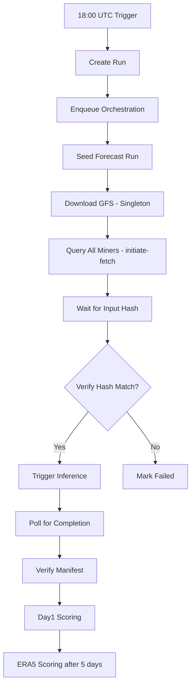
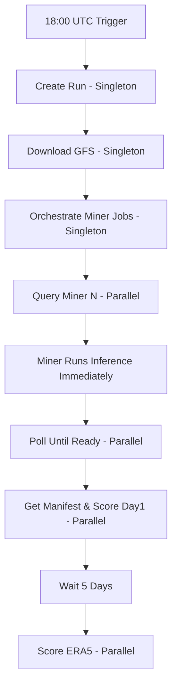

# Weather Task Refactoring Plan: Removing Input Verification & Implementing Parallel Processing

## Executive Summary
This document outlines the refactoring of the weather task pipeline to:
1. **Remove the input hash verification step** entirely
2. **Implement true parallel processing** for individual miner workflows
3. **Maintain singleton jobs** for shared resources (GFS download)
4. **Ensure clean state transitions** without legacy conflicts

---

## 1. Current System Analysis

### 1.1 Current Flow (WITH Verification)


### 1.2 Problems with Current System
1. **Input verification is wasteful**: Miners have no incentive to use different inputs
2. **Sequential bottleneck**: All miners wait for verification before inference
3. **Complex state machine**: Too many intermediate states (awaiting_input_hashes, verifying_input_hashes, etc.)
4. **Legacy code conflicts**: Old verification logic still present in multiple places

### 1.3 Current State Transitions (weather_miner_responses.status)
```
received → fetch_initiated → awaiting_input_hashes → input_validation_complete → 
inference_triggered → awaiting_inference_results → verifying_manifest → 
verified_manifest_store_opened → day1_scored → era5_scored
```

---

## 2. Target System Design

### 2.1 New Simplified Flow (WITHOUT Verification)


### 2.2 New State Transitions (Simplified)
```
created → fetch_initiated → inference_running → forecast_ready → 
day1_scoring → day1_scored → era5_scoring → era5_scored
```

### 2.3 Job Types & Parallelism
| Job Type | Singleton | Parallel | Description |
|----------|-----------|----------|-------------|
| weather.run.create | ✓ | | Create daily run at 18:00 UTC |
| weather.seed | ✓ | | Download & process GFS data |
| weather.orchestrate | ✓ | | Create per-miner jobs |
| weather.query_miner | | ✓ | Query individual miner |
| weather.poll_miner | | ✓ | Poll miner status |
| weather.day1_score | | ✓ | Score day1 for miner |
| weather.era5_score | | ✓ | Score ERA5 for miner |

---

## 3. Required Changes

### 3.1 Database Schema Changes
```sql
-- Simplify weather_miner_responses status enum
ALTER TYPE weather_response_status ADD VALUE IF NOT EXISTS 'inference_running';
ALTER TYPE weather_response_status ADD VALUE IF NOT EXISTS 'forecast_ready';

-- Remove unused columns
ALTER TABLE weather_miner_responses 
  DROP COLUMN IF EXISTS input_hash_miner,
  DROP COLUMN IF EXISTS input_hash_validator,
  DROP COLUMN IF EXISTS input_hash_match,
  DROP COLUMN IF EXISTS verification_passed;

-- Add columns for new flow
ALTER TABLE weather_miner_responses
  ADD COLUMN IF NOT EXISTS inference_started_at TIMESTAMP WITH TIME ZONE,
  ADD COLUMN IF NOT EXISTS manifest_hash VARCHAR(256),
  ADD COLUMN IF NOT EXISTS manifest_fetched_at TIMESTAMP WITH TIME ZONE;
```

### 3.2 Code Changes Required

#### 3.2.1 Remove Verification Step (`verify_step.py`)
- **DELETE** entire file - no longer needed
- Remove all references to `verify_step` in workers.py

#### 3.2.2 Update Orchestrator (`orchestrator.py`)
- Modify `orchestrate_run()` to create individual query jobs per miner
- Remove any verification-related logic
- Ensure proper job dependencies

#### 3.2.3 Update Workers (`workers.py`)
- Remove `weather.verify` job handler
- Add handlers for new job types
- Ensure proper error handling and retries

#### 3.2.4 Update Miner Routes (`weather_task.py`)
- Modify `handle_initiate_fetch` to immediately start inference
- Remove `handle_get_input_status` endpoint (no longer needed)
- Simplify response structure

#### 3.2.5 Update Scheduler (`scheduler.py`)
- Remove `next_to_verify` and `claim_to_verify` methods
- Simplify state transitions
- Update selection criteria for day1/era5

---

## 4. Implementation Steps

### Phase 1: Database & Schema Updates
1. Create migration to add new columns
2. Create migration to update status enums
3. Deploy migrations

### Phase 2: Remove Verification Logic
1. Delete `verify_step.py`
2. Remove verification handlers from `workers.py`
3. Remove verification-related database queries
4. Clean up unused imports

### Phase 3: Update Miner-Side Logic
1. Modify `handle_initiate_fetch` to trigger inference immediately
2. Remove input hash calculation
3. Simplify response structure
4. Update status transitions

### Phase 4: Update Orchestration
1. Modify `orchestrate_run` to create per-miner jobs
2. Implement proper job chaining
3. Add retry logic at job level

### Phase 5: Update Workers
1. Add new job type handlers
2. Implement parallel processing
3. Add proper error handling
4. Ensure idempotency

### Phase 6: Testing & Validation
1. Test singleton job execution
2. Test parallel job processing
3. Verify state transitions
4. Check error recovery

---

## 5. State Machine Definitions

### 5.1 Run Status (weather_forecast_runs)
```python
class RunStatus(Enum):
    CREATED = "created"
    GFS_DOWNLOADING = "gfs_downloading"
    GFS_READY = "gfs_ready"
    QUERYING_MINERS = "querying_miners"
    SCORING_DAY1 = "scoring_day1"
    AWAITING_ERA5 = "awaiting_era5"
    SCORING_ERA5 = "scoring_era5"
    COMPLETED = "completed"
    ERROR = "error"
```

### 5.2 Miner Response Status (weather_miner_responses)
```python
class MinerResponseStatus(Enum):
    CREATED = "created"
    FETCH_INITIATED = "fetch_initiated"
    INFERENCE_RUNNING = "inference_running"
    FORECAST_READY = "forecast_ready"
    DAY1_SCORING = "day1_scoring"
    DAY1_SCORED = "day1_scored"
    ERA5_SCORING = "era5_scoring"
    ERA5_SCORED = "era5_scored"
    FAILED = "failed"
```

### 5.3 Valid State Transitions
```python
VALID_TRANSITIONS = {
    "created": ["fetch_initiated", "failed"],
    "fetch_initiated": ["inference_running", "failed"],
    "inference_running": ["forecast_ready", "failed"],
    "forecast_ready": ["day1_scoring", "failed"],
    "day1_scoring": ["day1_scored", "failed"],
    "day1_scored": ["era5_scoring"],
    "era5_scoring": ["era5_scored", "failed"],
    "era5_scored": [],  # Terminal state
    "failed": []  # Terminal state
}
```

---

## 6. Error Handling & Retry Strategy

### 6.1 Retry Configuration
```python
RETRY_CONFIG = {
    "weather.query_miner": {
        "max_attempts": 3,
        "backoff": [60, 300, 900],  # 1min, 5min, 15min
    },
    "weather.poll_miner": {
        "max_attempts": 10,
        "backoff": 300,  # Fixed 5min intervals
    },
    "weather.day1_score": {
        "max_attempts": 3,
        "backoff": [300, 600, 1200],  # 5min, 10min, 20min
    },
    "weather.era5_score": {
        "max_attempts": 5,
        "backoff": 3600,  # 1 hour intervals
    }
}
```

### 6.2 Failure Handling
- Connection failures: Retry with backoff
- Miner offline: Mark as failed after max retries
- Invalid data: Log error, mark as failed, no retry
- Timeout: Retry with extended timeout

---

## 7. Migration Path

### 7.1 Backward Compatibility
- Keep old status values temporarily
- Map old states to new states during transition
- Clean up after all runs complete

### 7.2 Rollback Plan
- Database migrations are reversible
- Keep backup of old code
- Feature flag to enable/disable new flow

---

## 8. Success Criteria

1. **No input verification delays**: Inference starts immediately
2. **True parallel processing**: Each miner processed independently
3. **Clean state machine**: Simple, predictable transitions
4. **Robust error handling**: Automatic retries with backoff
5. **No legacy conflicts**: Old code completely removed/bypassed
6. **Performance improvement**: 50% reduction in time to first score

---

## 9. Timeline

- **Week 1**: Database changes, remove verification logic
- **Week 2**: Update orchestration and workers
- **Week 3**: Testing and validation
- **Week 4**: Production deployment

---

## Appendix A: File Change Summary

### Files to Delete
- `gaia/tasks/defined_tasks/weather/pipeline/steps/verify_step.py`

### Files to Modify
- `gaia/tasks/defined_tasks/weather/pipeline/orchestrator.py`
- `gaia/tasks/defined_tasks/weather/pipeline/workers.py`
- `gaia/tasks/defined_tasks/weather/pipeline/scheduler.py`
- `gaia/tasks/defined_tasks/weather/weather_task.py`
- `gaia/validator/database/validator_database_manager.py`
- `gaia/database/validator_schema.py`

### Files to Create
- `gaia/tasks/defined_tasks/weather/pipeline/steps/query_miner_step.py`
- `gaia/tasks/defined_tasks/weather/pipeline/steps/poll_miner_step.py`
