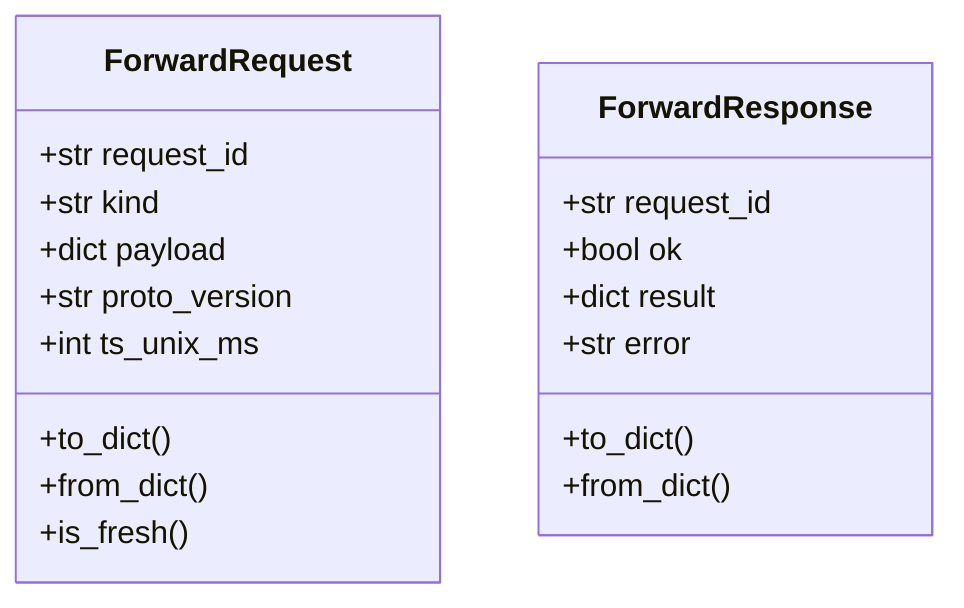
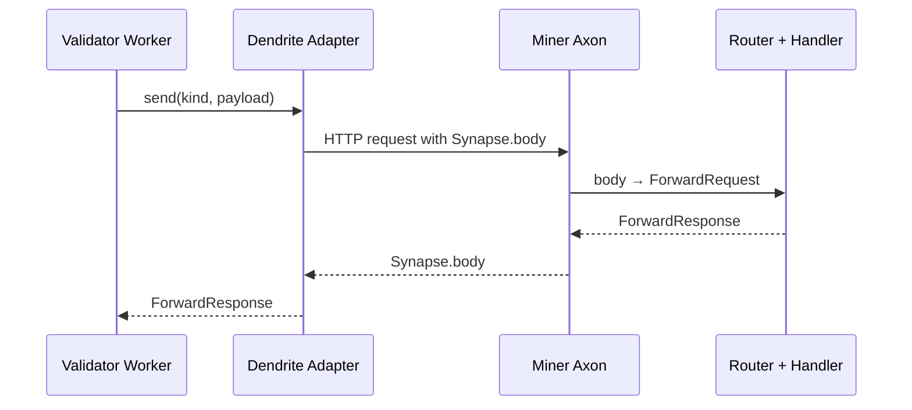
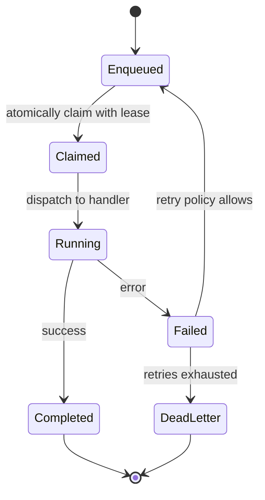
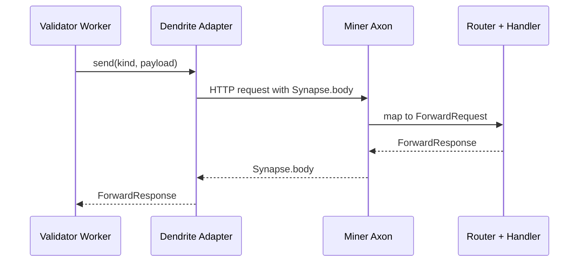

## Architecture

This document is the go-to technical reference for how the codebase is organized and how the two node applications (Miner and Validator) communicate and fit together. It is structured in three sections: Protocol (shared), Miner, and Validator.

## Protocol (shared networking protocol)

- Purpose: Define a stable, SDK-agnostic contract between Validator and Miner. Keep Bittensor specifics behind thin adapters.
- Transport & security: Axon/Dendrite communicate over HTTP. Integrity/auth via hotkey signatures and nonces; no TLS by default. If confidentiality is required, terminate TLS at a reverse proxy or tunnel. No heartbeat is used.
- Versioning & freshness: Requests embed a protocol version and timestamp; Miners enforce version match and replay protection (freshness window).
- Serialization: Requests and responses are encoded to/from dictionaries (stored in `Synapse.body`).

Files

- `new/shared/networking/protocol.py`: `ForwardRequest`, `ForwardResponse`, versioning, freshness helpers.
- `new/shared/networking/endpoint.py`: `Endpoint` descriptor (url, hotkey) used by Validator to address Miners.

Schema (high-level)

- `ForwardRequest`: request_id, kind, payload (dict), proto_version, ts_unix_ms.
- `ForwardResponse`: request_id, ok (bool), result (dict), error (str|None).

Diagram



Extension points

- Add new kinds (routes) without leaking SDK types.
- Evolve the protocol by incrementing `proto_version` and performing gated accept/reject at the Miner router.

## Miner

Responsibilities

- Serve a single Axon `forward` entrypoint and dispatch to domain handlers based on `ForwardRequest.kind`.
- Enforce protocol version and freshness; return `ForwardResponse`.

Components

- Router: `new/miner/router/forward.py`
  - `ForwardRouter`: registry mapping kind → async handler.
  - `forward(synapse, router)`: Axon adapter converting Synapse.body ⇄ ForwardRequest/ForwardResponse.
  - Example handler: `weather.forward` (placeholder; replace with real logic).

- Server: `new/miner/server.py`
  - `MinerServer`: constructs Axon (SDK tolerant), binds `forward`, manages start/stop (serve/start/close/stop variants).
  - Hooks for blacklist/priority can be added later. No heartbeat.

Flow

```mermaid
flowchart TD
    A[Axon receives Synapse] --> B[Adapter: body → ForwardRequest]
    B --> C{ForwardRouter}
    C -->|version/fresh ok| D[Handler (by kind)]
    C -->|reject| E[Error ForwardResponse]
    D --> F[ForwardResponse]
    E --> F
    F --> G[Adapter: ForwardResponse → body]
    G --> H[Return Synapse]
```

Notes

- Transport is HTTP; use reverse proxy/tunnel only if confidentiality is required.
- We provide auto TLS proxy setup at boot via YAML: see `new/config/{miner,validator}.config.yaml` and `new/core/setup/proxy.py`.
- Keep handler code domain-focused; the adapter is the sole place that touches Bittensor types.

## Validator

Responsibilities

- Maintain a job-driven worker pipeline. Query Miners using the protocol and adapters, validate and score responses, persist results, and set weights on-chain (outside this skeleton’s scope for detailed chain ops).

Components

- Client adapter & broadcast helper: `new/validator/validator.py`
  - `DendriteClientAdapter.send(endpoint, req)`: builds `Synapse` with `body`, sends to endpoint URL, parses `body` into `ForwardResponse`.
  - `query_miners(endpoints, kind, payload, config)`: concurrent broadcast and gather.
  - `Validator` class: shell that inherits `BaseNeuron` for wallet/subtensor/bootstrap when needed.

- Worker and job architecture (validator-side core)
  - Job queue (PostgreSQL): `enqueue`, `claim` (lease), `complete`, `fail`, retries/backoff; idempotent handlers.
  - Dispatcher: job.type → handler (async). Weather is one job family; architecture is generic for other tasks.
  - Workers: N concurrent workers claim jobs, execute handlers, and persist outputs.
  - Networking loop: handlers call `query_miners()` with `kind` and payload, validate/score, persist, emit stats.
  - Stats & weights: aggregate performance over windows; translate to chain weights with optional perturbation and epoch cadence.

Files

- `new/validator/validator.py`: adapter, broadcast helper, class shell.
- `new/core/neuron.py`: BaseNeuron bootstrap (wallet/subtensor/logging scaffolding).
- `new/core/utils/config.py`, `new/core/utils/logging.py`: configuration, logging setup used by neurons.

Flows

Worker/queue

```mermaid
flowchart LR
    A[Enqueuer] -->|enqueue(job)| Q[(Postgres Queue)]
    subgraph Workers
      W1[Worker] -->|claim| Q
      W1 -->|dispatch| D[Dispatcher]
      D --> H1[Job Handler]
      H1 -->|query miners| N[DendriteClientAdapter]
      N --> M[(Miners)]
      H1 -->|persist results| Q
      H1 -->|emit stats| S[Stats Aggregator]
    end
    S --> W[Weights Service]
    W --> C[Chain]
```

Validator↔Miner sequence



Notes

- Endpoint lists are static; no dynamic metagraph discovery. Unreachable Miners fail fast and are penalized by scoring policy.
- Concurrency: asyncio-based parallel queries. Scale workers by process/task count to match workload.
- Upgrades: protocol versioning allows controlled rollouts; handlers should be idempotent to support retries.
- TLS proxy & hosting: boot preflight configures Nginx for HTTPS and optional static hosting (`new/core/setup/{proxy,hosting}.py`).

Quick usage

Validator

```python
endpoints = [Endpoint(url="https://1.2.3.4:8091/forward", hotkey="...ss58...")]
payload = {"inputs": {...}}
responses = await query_miners(endpoints, "weather.forward", payload, config)
```

Miner

```python
server = MinerServer(host="0.0.0.0", port=8091)
await server.start()
# serving
await server.stop()
```

Architecture overview

Scope

- This document captures the current miner/validator skeleton using Bittensor adapters. It explains components, responsibilities, data flow, configuration, and extension points. Business logic remains unchanged.

Goals and principles

- Hide Bittensor behind thin adapters (Axon/Dendrite) and present a FastAPI/httpx mental model.
- Single forward router on miner dispatching by kind.
- Statically configured validator endpoints. No heartbeat. No metagraph discovery.
- Async-first. Minimal moving parts.

Top-level layout

- new/core
  - utils/config.py: CLI/config plumbing for wallet, subtensor, logging, neuron args.
  - utils/logging.py: Events logger setup (registered by config).
  - neuron.py: BaseNeuron (wallet/subtensor/metagraph bootstrap, sync/set-weights scaffolding).
- new/shared
  - networking/protocol.py: ForwardRequest/ForwardResponse, freshness checks, protocol versioning.
  - networking/endpoint.py: Endpoint (url, hotkey). Validator uses a static list.
- new/miner
  - router/forward.py: ForwardRouter and Axon adapter function forward(synapse, router). Example handler weather.forward.
  - server.py: MinerServer creates Axon, binds forward, handles start/stop (SDK tolerant).
  - database/*: placeholder for miner-local persistence.
- new/validator
  - validator.py: DendriteClientAdapter and query_miners helper. Validator class shell.
- new/docs
  - miner.md: Miner adapter/forward router mental model.
  - validator.md: Validator adapter/endpoint mental model.
  - architecture.md: This document.

Key components

1) Protocol (shared)

- ForwardRequest: kind (route key), payload (dict), request_id, proto version, timestamp. Helpers for creation, serialization, and freshness.
- ForwardResponse: ok/error/result, with helpers and serialization.
- Stable wire contract decoupled from SDK specifics.

2) Miner side

- ForwardRouter (new/miner/router/forward.py)
  - Registers handlers keyed by kind.
  - Enforces protocol version and freshness, then dispatches to handler.
  - Example handler handle_weather_forward echoing payload (replace with real logic).
- Axon adapter forward(synapse, router)
  - Converts Synapse.body to ForwardRequest, invokes router, converts ForwardResponse back into Synapse.body.
  - Only place touching SDK types on miner side.
- MinerServer (new/miner/server.py)
  - Creates Axon (bt.Axon or bt.axon), binds forward, starts/stops via serve/start methods (async or sync), gracefully closes.
  - No heartbeat. Hooks for blacklist/priority can be added later.

3) Validator side

- Endpoint (new/shared/networking/endpoint.py)
  - Describes a miner target with url and optional hotkey.
  - Static list, defined by configuration or caller.
- DendriteClientAdapter (new/validator/validator.py)
  - Wraps Dendrite send(endpoint, req): builds Synapse with body, sends to target (Endpoint.url or raw), extracts body into ForwardResponse.
- query_miners(endpoints, kind, payload, config)
  - Broadcast helper to send to many endpoints concurrently and gather responses.
- Validator (new/validator/validator.py)
  - Inherits BaseNeuron for standard SDK bootstrap when needed; orchestration logic remains SDK-agnostic.

Data flow

- Validator
  - Build ForwardRequest(kind, payload)
  - Send via DendriteClientAdapter to each Endpoint
  - Receive ForwardResponse per miner and continue scoring/aggregation (outside this skeleton)

- Miner
  - Axon receives Synapse
  - Adapter maps to ForwardRequest => ForwardRouter dispatches => handler returns ForwardResponse
  - Adapter writes response into Synapse.body and returns

Configuration and environment

- CLI and SDK config live in new/core/utils/config.py. Endpoint lists are expected to be provided by the caller or app-level config when initiating queries.
- Logging uses Bittensor logging configuration and optional events file logging.

Extension points

- Add miner handlers: router.register("my.kind", handler)
- Add validator routes: call query_miners with new kinds/payloads
- Extend protocol: add fields to request/response types; adapters carry the mapping
- Scheduling: integrate query_miners into your job queue or orchestrator loops

Out of scope (in this skeleton)

- Heartbeat, vpermit enforcement, blacklist/priority
- Dynamic metagraph discovery and endpoint caching
- Full weather pipeline refactor

Quick usage sketches

Validator

```python
endpoints = [Endpoint(url="https://1.2.3.4:8091/forward", hotkey="...ss58...")]
payload = {"inputs": {...}}
responses = await query_miners(endpoints, "weather.forward", payload, config)
```

Miner

```python
server = MinerServer(host="0.0.0.0", port=8091)
await server.start()
# serving
await server.stop()
```


Miner (detailed)

```mermaid
flowchart TD
    A[Axon adapter forward(synapse, router)] --> B[Parse Synapse.body → ForwardRequest]
    B --> C{ForwardRouter}
    C -->|proto/fresh ok| D[Handler by kind]
    C -->|fail| E[Error ForwardResponse]
    D --> F[ForwardResponse]
    F --> G[Write Synapse.body]
    E --> G
```

Protocol (shared)


Validator (detailed)

```mermaid
flowchart TD
    V1[Build ForwardRequest(kind,payload)] --> V2[For each Endpoint]
    V2 --> V3[DendriteClientAdapter.send()]
    V3 --> V4[Build Synapse with body]
    V4 --> V5[Send to target URL]
    V5 --> V6[Receive Synapse]
    V6 --> V7[Extract body → ForwardResponse]
    V7 --> V8[Aggregate/score downstream]
```

Distributed system overview

- Subnet roles: Validators query miners, score responses, and set weights on-chain. Miners serve forward requests and produce task-specific outputs.
- Discovery: Not used here; validator holds a static list of miner endpoints. Unreachable miners are treated as failures.
- Security: Requests/responses are integrity-protected via Bittensor signing/nonces. Transport is HTTP (no TLS); add proxy/tunnel if confidentiality is needed.
- Fault model: Miner downtime/network errors return failed ForwardResponse; validators proceed and weight according to scoring policy.
- Scalability: Validators parallelize queries with asyncio; miners attach additional handlers to serve multiple kinds.
- Upgrades: Protocol versioning in `ForwardRequest` allows controlled rollouts; router can reject mismatched versions.

Validator workers and job architecture

Overview

- The validator operates a job-driven pipeline. Work units (jobs) are persisted in the database and executed by a pool of workers.
- A dispatcher maps job types to handlers. Weather jobs are one class of jobs; the architecture is generic for additional tasks.
- The validator queries miners as part of job execution, scores results, persists outputs, and ultimately influences on-chain weights.

Components

- Job queue and persistence
  - Backed by PostgreSQL. Each job has an id, type, payload, status (enqueued/claimed/completed/failed), retry counters, and timestamps.
  - Operations: enqueue, claim (lease with timeout), heartbeat/extend (optional), complete, fail (with error), retry policy.
  - Guarantees: at-least-once execution with idempotent handlers; mutually-exclusive claims enforced via SQL (transaction or SKIP LOCKED semantics).

- Dispatcher and workers
  - Dispatcher: maps job.type → handler callable. Handlers are async and encapsulate domain logic (e.g., `weather.forward` scoring).
  - Workers: N processes/async tasks fetch jobs, execute, and commit results. Concurrency controls are configurable.
  - Backoff/retry: exponential or bounded retry (e.g., fixed caps per job type); poison-queue semantics for repeatedly failing jobs.

- Networking and scoring loop
  - For jobs that require miner interaction, workers call `query_miners()` with the appropriate `kind` and payload.
  - Responses are validated, scored, and aggregated. Results persist to DB and feed the stats/weights subsystems.

- Statistics and weights
  - Statistics: domain-level aggregation (e.g., weather metrics) to compute miner performance across windows.
  - Weights: translate scores into on-chain weights (optionally with random perturbation). Setting weights occurs on epoch cadence.

- Data & housekeeping
  - Baseline/reference data, caches, and tokens (e.g., Earthdata) are maintained outside the hot path and refreshed with dedicated jobs.
  - Backups and replication (pgBackRest/AutoSync) ensure DB durability and fast recovery; monitored by separate maintenance routines.

Job lifecycle



Worker/queue data flow

```mermaid
flowchart LR
    A[Enqueuer] -->|enqueue(job)| Q[(Postgres Queue)]
    subgraph Workers
      W1[Worker] -->|claim| Q
      W1 -->|dispatch| D[Dispatcher]
      D --> H1[Job Handler]
      H1 -->|query miners| N[DendriteClientAdapter]
      N --> M[(Miners)]
      H1 -->|persist results| Q
      H1 -->|emit stats| S[Stats Aggregator]
    end
    S --> W[Weights Service]
    W --> C[Chain]
```

Validator and miner interaction (sequence)



Notes

- This architecture maintains a strict separation: workers own business logic and persistence; adapters own transport.
- Weather remains one task among many; handlers must be idempotent and side-effect safe for retries.
- Endpoint lists are static; unreachable miners fail fast and are penalized via scoring.

